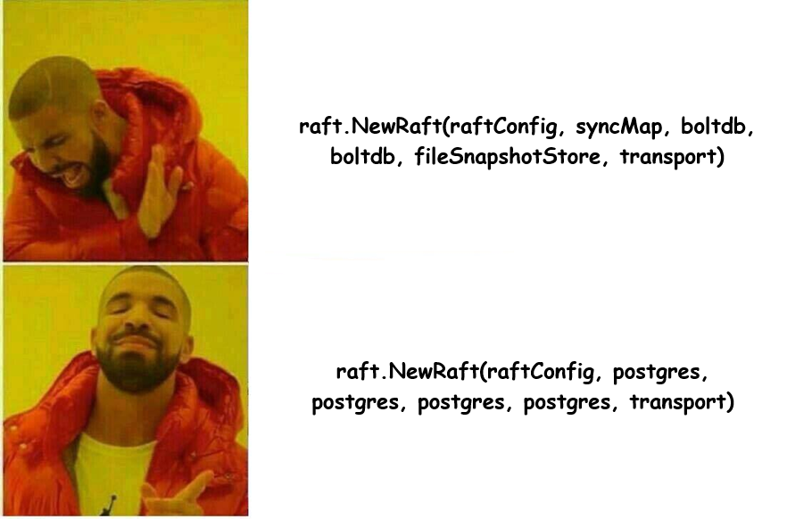
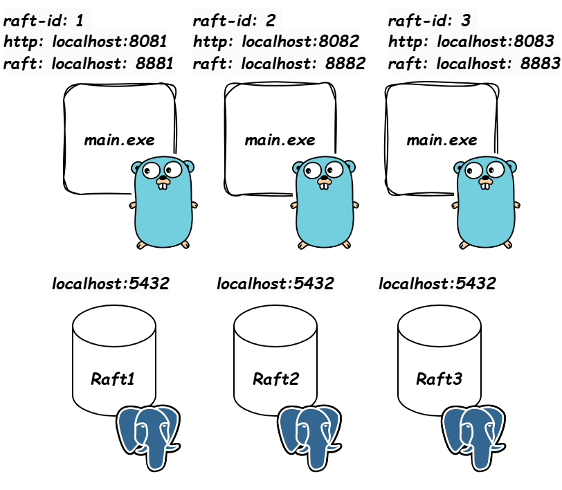

# RaftWithPostgresAsStore

This repo is highly inspired by [eatonphil](https://github.com/eatonphil) [raft-example repo](https://github.com/eatonphil/raft-example) and [https://github.com/jen20](https://github.com/jen20) [hashiconf-raft repo](https://github.com/jen20/hashiconf-raft) along with [Practical Distributed Consensus using HashiCorp/raft youtube video](https://www.youtube.com/watch?v=EGRmmxVFOfE)

One day I was deep diving into replication algorithms. I stumbled upon many examples utilizing [hashicorp raft library](https://github.com/hashicorp/raft) for this purpose. But all of those examples utilized in-memory and/or disk based data structures for storage. I thought: "what if instead of using in-memory just use simple, beloved postgres?". So I did it.

Pic.1 Meme

I am not certain if each of the domains of the raft (snapshots, fsms, logs, stable logs) should be persisted on database. Maybe there are better ways and my current understanding of raft is simply poor but I just went with it. Speaking of caveats... 

## Caveats

- Snapshots storage is not implemented at all. Maybe I will have more time in the future to do it
- I tried to containerize this application (as every project I touch), however no matter what I did it was impossible. I binded the http port to 0.0.0.0, I binded the raft port to 0.0.0.0 and set the advertise raft port to 127.0.0.1 or host.docker.internal or local machine IP (I did so because raft needs advertisable address and 0.0.0.0 is not advertisible but sockets need to be binded 0.0.0.0 in order to receive requests from outside of the container) and it should work but no matter what I did I got empty reponse on raft port

## Prerequisites

- Postgres database with three empty databases named Raft1, Raft2, Raft3

## Technology

Pic.2 Visualization of project

- Go 1.25
- Gorm 1.31
- Raft 1.7.3

## QuickStartup 

Build

`go build`

Run three instances

`./main.exe --raft-id 1 --http-port 8081 --raft-port 8881 --db-name Raft1`

`./main.exe --raft-id 2 --http-port 8082 --raft-port 8882 --db-name Raft2`

`./main.exe --raft-id 3 --http-port 8083 --raft-port 8883 --db-name Raft3`

Add followers to the leader

`curl http://localhost:8081/join?followerAddress=localhost:8882&followerId=2`

`curl http://localhost:8081/join?followerAddress=localhost:8883&followerId=3`

Send key value to the leader

`curl -X POST http://127.0.0.1:8081/value -d '{"key": "x", "value": "23"}'`

Get value from all nodes. Data has been replicated

`curl -X GET http://127.0.0.1:8081/value?key=x`

`curl -X GET http://127.0.0.1:8082/value?key=x`

`curl -X GET http://127.0.0.1:8083/value?key=x`

## Sources

- [raft-example by eatonphil](https://github.com/eatonphil/raft-example)
- [hashiconf-raft by jen20](https://github.com/jen20/hashiconf-raft)
- [Practical Distributed Consensus using HashiCorp/raft on youtube](https://www.youtube.com/watch?v=EGRmmxVFOfE)
- [Understand RAFT without breaking your brain on youtube](https://www.youtube.com/watch?v=IujMVjKvWP4)

